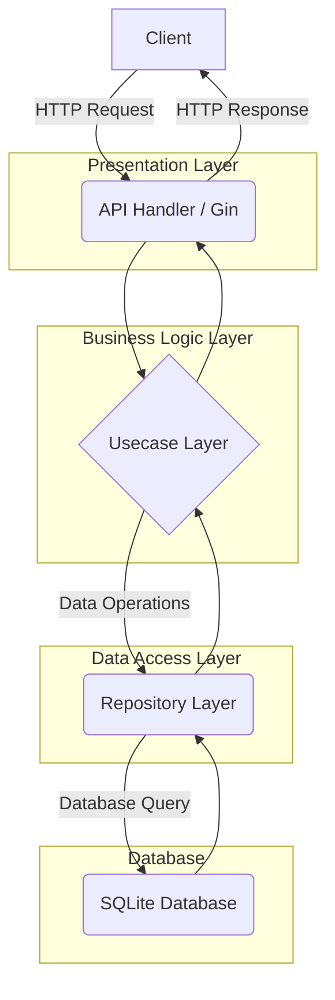

# Warung Online API

API untuk manajemen order dan stok warung berbasis Go dengan clean architecture dan database SQLite.

## Gambaran Sistem dan Arsitektur

Proyek ini mengadopsi pendekatan **Clean Architecture** untuk memisahkan lapisan-lapisan aplikasi, sehingga lebih mudah dikelola, diuji, dan dikembangkan. Berikut adalah gambaran alur data dan struktur utama:



### Struktur Direktori

- **`api/`**: Berisi semua yang terkait dengan lapisan presentasi (HTTP).
  - `handler.go`: Mengelola logika untuk menerima permintaan HTTP dan mengirim respons.
  - `router.go`: Mendefinisikan semua rute API.
  - `response.go`: Utilitas untuk standardisasi format respons JSON.
- **`internal/`**: Direktori inti yang berisi logika bisnis dan akses data.
  - `entity/`: Mendefinisikan struct Go yang merepresentasikan entitas inti seperti `Order`, `Stock`, dan `OrderItem`.
  - `usecase/`: Lapisan yang berisi logika bisnis utama. Misalnya, `CreateOrder` di sini akan memvalidasi stok sebelum membuat pesanan.
  - `repository/`: Lapisan yang bertanggung jawab untuk berinteraksi dengan database. Ini mengimplementasikan antarmuka yang didefinisikan di `usecase`.
- **`docs/`**: Berisi file dokumentasi Swagger yang dihasilkan secara otomatis.
- **`main.go`**: Titik masuk aplikasi, di mana semua komponen (database, repositori, usecase, dan router) diinisialisasi.

## Menjalankan Project

1. Pastikan Go sudah terinstall.
2. Jalankan perintah berikut:

   ```sh
   go run main.go
   ```

## Catatan

- Database default: SQLite (file `warung.db`)
- Struktur mengikuti clean architecture.

## Alur Kerja End-to-End: Dari Stok ke Pesanan

Sistem ini dirancang untuk memastikan bahwa setiap pesanan yang dibuat akan secara otomatis memengaruhi ketersediaan stok. Berikut adalah alur kerja lengkapnya:

### 1. Membuat Entri Stok

Langkah pertama adalah mendaftarkan produk ke dalam inventaris. Ini dilakukan dengan membuat entri stok baru melalui endpoint `POST /stocks`.

**Contoh Permintaan:**

```http
POST /stocks
Content-Type: application/json

{
    "name": "Kopi Susu",
    "price": 18000,
    "quantity": 50
}
```

- Permintaan ini akan membuat produk baru bernama "Kopi Susu" dengan harga `18000` dan kuantitas awal `50`.
- Database akan menyimpan data ini di tabel `stocks` dan menghasilkan `id` unik untuk item ini (misalnya, `id: 1`).

### 2. Membuat Pesanan

Setelah stok tersedia, pelanggan dapat membuat pesanan. Pesanan dapat terdiri dari satu atau beberapa item.

**Contoh Permintaan:**

Permintaan ini dibuat ke endpoint `POST /orders` dan berisi nama pelanggan serta daftar item yang dipesan (`stock_id` dan `quantity`).

```http
POST /orders
Content-Type: application/json

{
    "customer_name": "Budi",
    "items": [
        {
            "stock_id": 1, 
            "quantity": 2
        }
    ]
}
```

### 3. Proses Logika Bisnis di Balik Layar

Saat permintaan di atas diterima, berikut adalah apa yang terjadi di dalam `OrderUsecase`:

1. **Validasi Stok**: Sistem akan memeriksa ketersediaan stok untuk setiap item dalam pesanan.
    - Ia akan mengambil data stok untuk `stock_id: 1`.
    - Memastikan bahwa kuantitas yang diminta (`2`) tidak melebihi stok yang tersedia (`50`).
    - Jika stok tidak mencukupi, proses akan berhenti dan mengembalikan pesan kesalahan.

2. **Perhitungan Total**: Sistem menghitung total harga pesanan berdasarkan harga item dari tabel `stocks` dan kuantitas yang dipesan.

3. **Transaksi Database**: Untuk menjaga integritas data, semua operasi database (membuat pesanan dan mengurangi stok) dijalankan dalam satu **transaksi**.
    - **Membuat Pesanan**: Entri baru dibuat di tabel `orders` dan `order_items`.
    - **Mengurangi Stok**: Kuantitas di tabel `stocks` untuk `stock_id: 1` akan dikurangi sebanyak `2` (menjadi `48`).

4. **Commit atau Rollback**:
    - Jika semua langkah berhasil, transaksi akan di-**commit**, dan perubahan akan disimpan secara permanen.
    - Jika terjadi kegagalan di salah satu langkah (misalnya, database error), seluruh transaksi akan di-**rollback**, dan data akan kembali ke keadaan semula seolah-olah tidak ada operasi yang terjadi.

### 4. Respons API

Jika berhasil, API akan mengembalikan respons yang berisi detail pesanan yang baru dibuat, termasuk `id` pesanan, total harga, dan item yang dibeli.

**Contoh Respons:**

```json
{
    "status": "success",
    "code": 201,
    "data": {
        "id": 101,
        "customer_name": "Budi",
        "order_date": "2023-10-27T10:00:00Z",
        "total_amount": 36000,
        "items": [
            {
                "id": 201,
                "order_id": 101,
                "stock_id": 1,
                "quantity": 2,
                "price": 18000
            }
        ]
    }
}
```

Alur kerja ini memastikan bahwa data stok dan pesanan selalu konsisten dan akurat.
